# tcp-ip-attack-analysis-lab

## Overview 

This project documents a controlled university cybersecurity lab examining attacks against TCP connections and sessions. The lab investigated TCP reset attacks against Telnet and SSH, ICMP-based connection disruption, and TCP session hijacking.

Wireshark was used to capture and analyze network traffic, while packet-generation tools were used to reproduce the techniques in an isolated lab environment.
The purpose was to understand how these attacks work and identify appropriate defensive measures.

> **Ethical Scope:** The techniques documented in this repository are presented strictly for education and defensive purposes.

## Lab Objectives

- Analyze TCP reset attacks against Telnet and SSH connections.
- Examine TCMP Destination Unreachable and Source Quench messages.
- Inspect TCP flags, sequence numbers, and acknowledgement numbers using Wireshark.
- Demonstrate the security risks of using unencrypted Telnet sessions.
- Compare the security properties of Telnet and SSH.
- Identify defensive controls against connection disruption and session hijacking.

## Tools Used

- Linux virtual machines
- Wireshark
- Netwag
- Telnet
- OpenSSH
- ICMP utilities

## 1. TCP RST Attack Against Telnet

### Technique

A TCP Reset (`RST`) packet tells a device to terminate a TCP connection immediately. If a forged reset packet contains information that matches an active connection, the receiving system may accept it and close the session.

In this experiment, a TCP reset packet was generated against an established Telnet connection to observe its effect on session availability.

### Establishing the Telnet Connection

A Telnet connection was first established between the designated virtual machines. The active session provided a baseline before the reset packet was introduced.

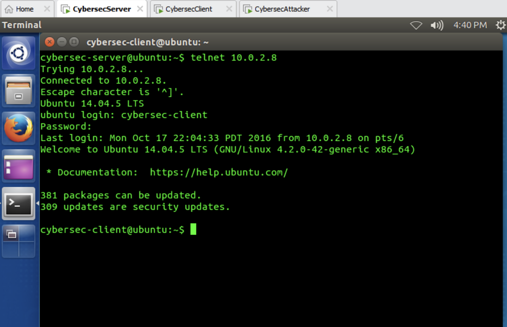

**Observation:** The terminal confirmed that the Telnet connection was active and accepting commands normally.

### Generating the TCP Reset Packet

Netwag was used inside the isolated lab to generate a TCP reset packet associated with the active Telnet connection.

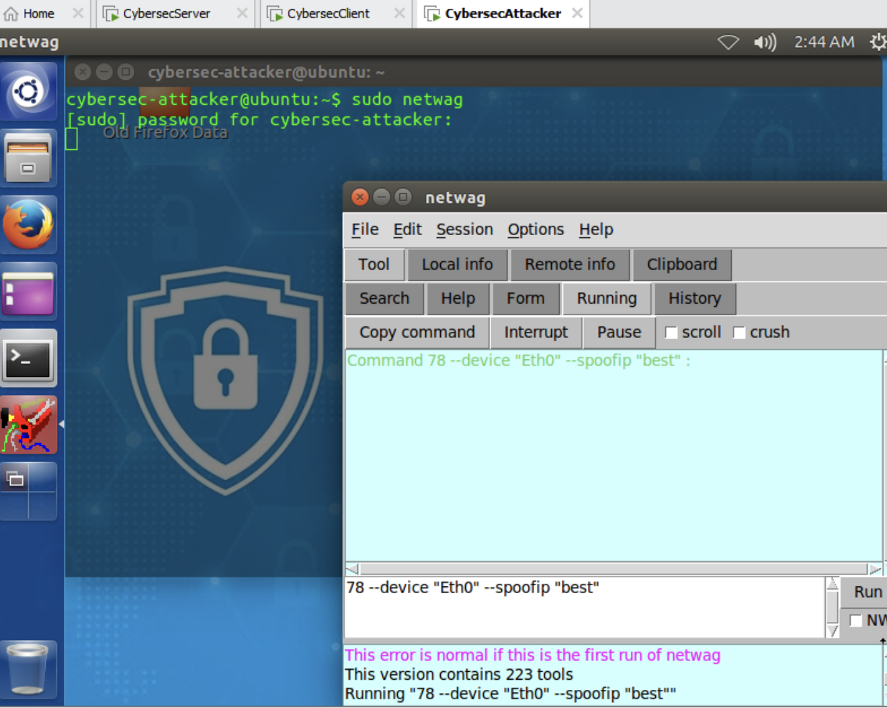

**Observation:** The packet-generation interface was configured to reproduce a TCP reset scenario against the designated lab connection.

### Connection Termination

After the reset packet was transmitted, the Telnet session was immediately interrupted.

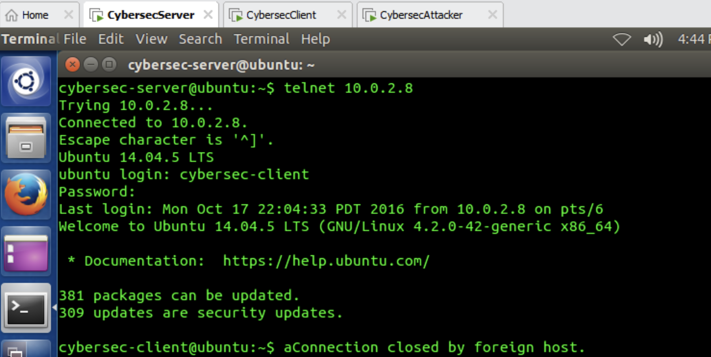

**Result:** The terminal displayed the message `Connection closed by foreign host`, confirming that the active TCP session had been terminated.

### Security Analysis

This experiment demonstrates that forged TCP reset packets can be used to disrupt established connections, producing a denial-of-service condition. Telnet is especially unsafe because it transmits session data without encryption, making connection information and application content easier to observe.

Potential defensive measures include:

- Replacing Telnet with SSH for remote administration.
- Using stateful firewalls to validate established connections.
- Monitoring unexpected or repeated TCP `RST` packets.
- Applying ingress and egress filtering to reduce IP address spoofing.
- Keeping operating systems and network devices updated.

## 2. TCP RST Attack Against SSH

### Technique 

SSH encrypts communication between the client and server, protecting login credentials, commands, and transmitted data. However, SSH operates over TCP, so disrupting the underlying TCP connection can still terminate an SSH session.

This experiment examined whether a TCP reset packet could interrupt an established SSH connection in the controlled lab environment.

## Establishing the SSH Connection

An SSH connection was established between the designated virutal machines. The terminal confirmed that the client had successfully authenticated and connected to the remote system.

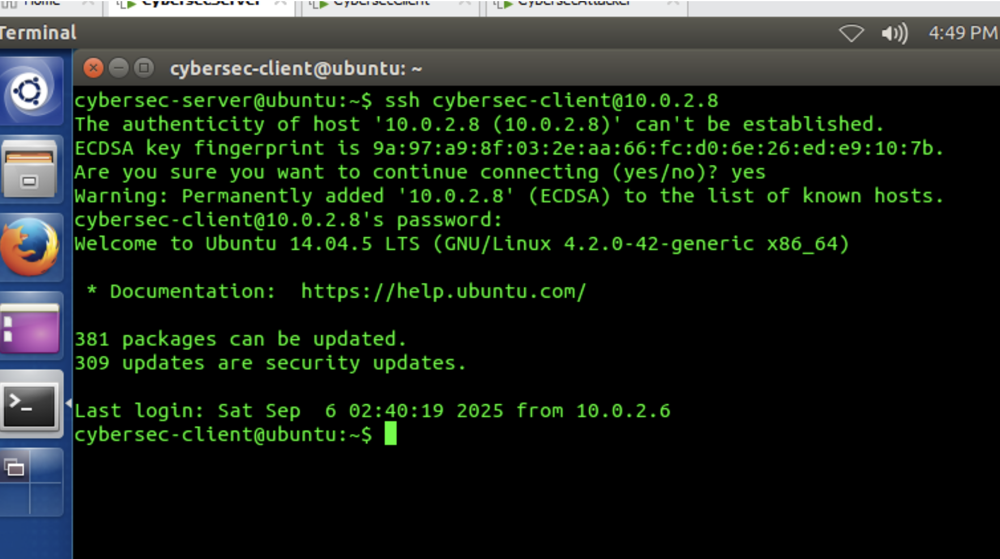

**Obeservation:** The SSH session was active and operating normally before the reset packet was introduced.

### Generating the TCP Reset Packet

Netwag was configured to generate a TCP reset packet associated with the active SSH connection.

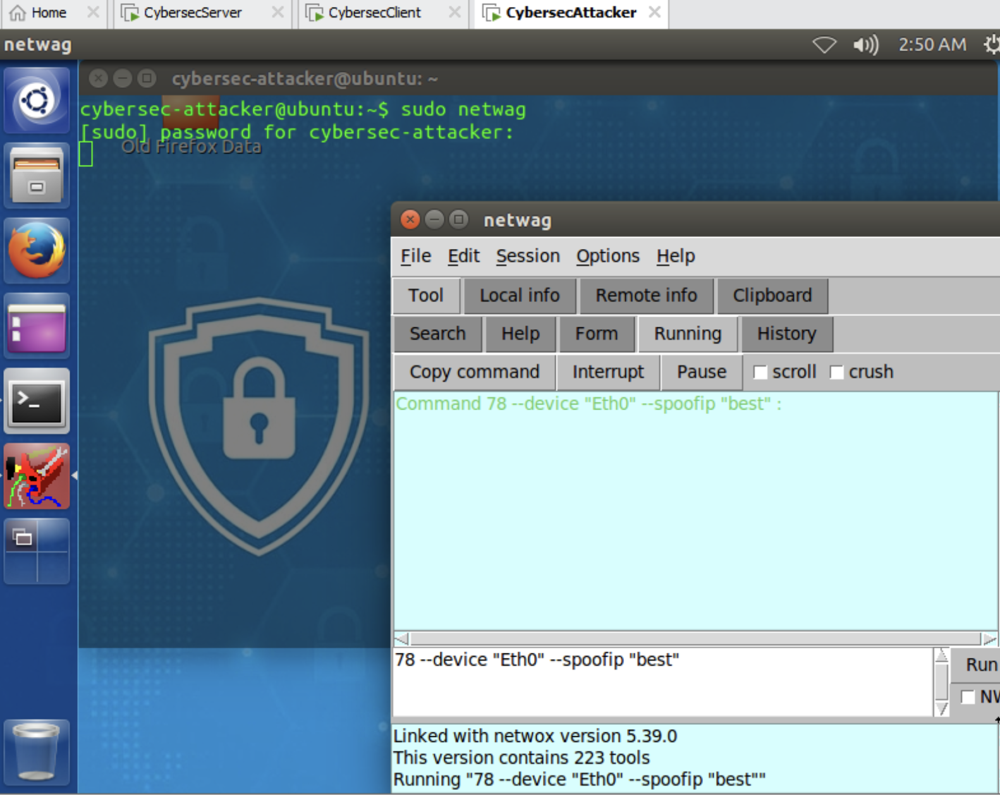

**Observation:** Although SSH encrypted the application data, it continued to depend on the underlying TCP connection.

### Connection Termination

After the reset packet was transmitted, the SSH connection was interrupted.

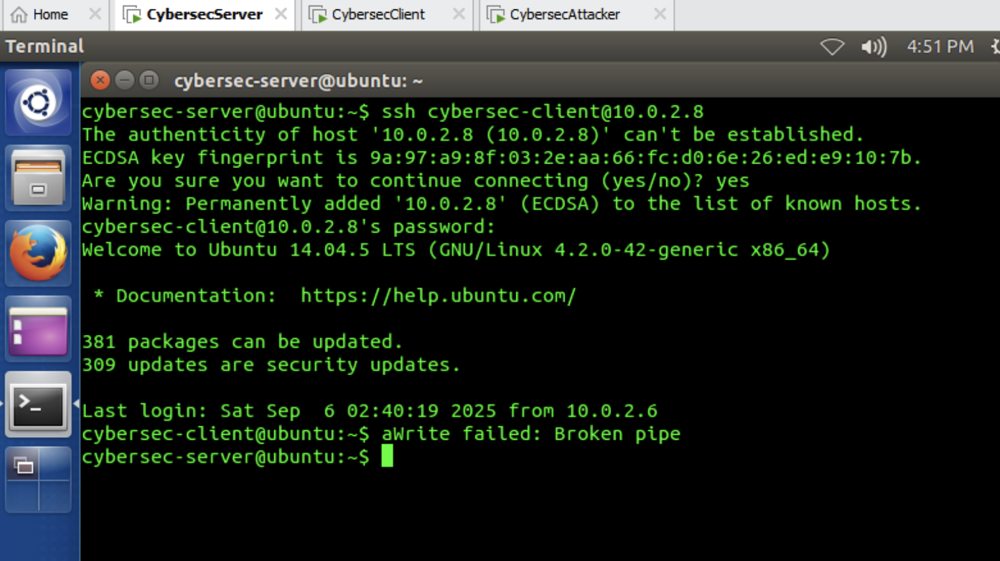

**Result:** The SSH client displayed a `Broken pipe` message, confirming that the underlying TCP session had been terminated.

### Security Analysis

This result does not indicate that SSH encryption was broken. The contents of the SSH session remained protected, but the connection itself became unavailable because its TCP transport was disrupted.

This demonstrates the difference between confidentiality and availability:

- SSH protects the confidentiality and integrity of transmitted data.
- TCP reset attacks target connection availability.
- Encryption alone cannot prevent every denial-of-service attack.
- Stateful firewalls and modern TCP validation can reduce the acceptance or suspicious reset packets.
- Monitoring repeated or unexpected TCP `RST` packets can help identify attempted disruption.

## 3. ICMP Blind Connection-Reset Attack

### Technique 

ICMP error messages are normally used to report network-delivery problems. For example, an ICMP Destination Unreachable message may indicate that a destination, protocol, or port cannot be reached.

However, forged ICMP error messages can potentially mislead a receiving system into believing that legitimate traffic cannot be delivered. This may interrupt or influence an existing connection, resulting in a denial-of-service condition.

## Capturing the Baseline Traffic

Wireshark was used to capture the original network traffic before the forged ICMP message was introduced.

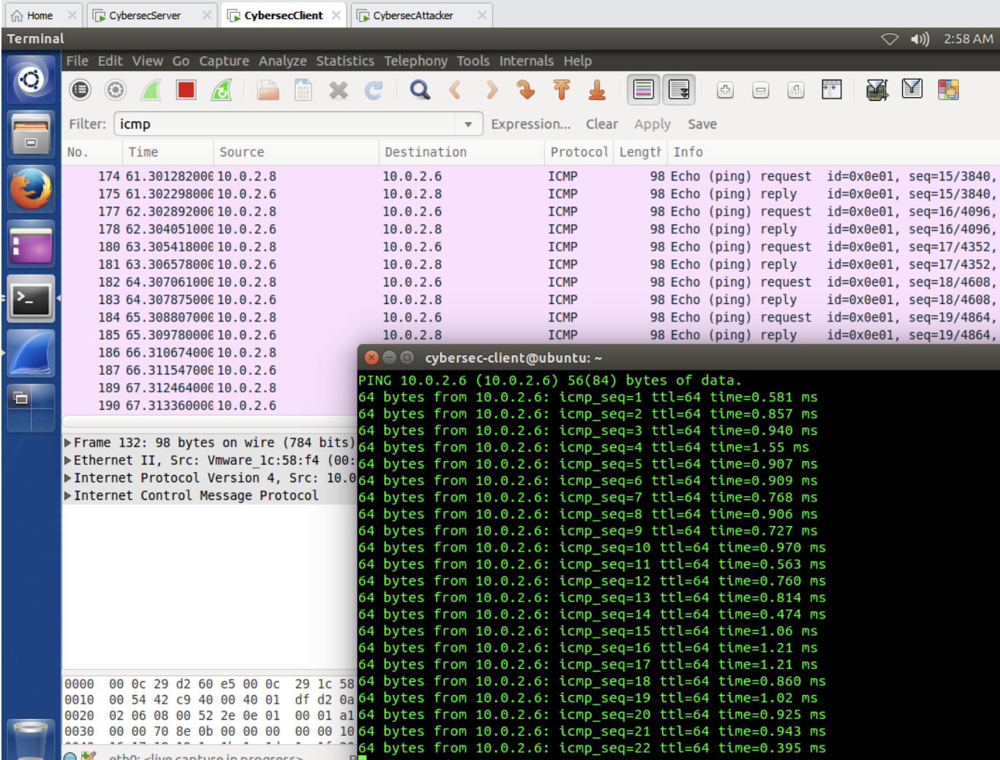

**Observation:** The capture established the normal traffic pattern and provided the packet information needed for comparison.

### Generating an ICMP Destination Unreachable Message

Netwag was configured in the isolated lab environment to generate an ICMP Destination Unreachable message associated with the selected traffic.

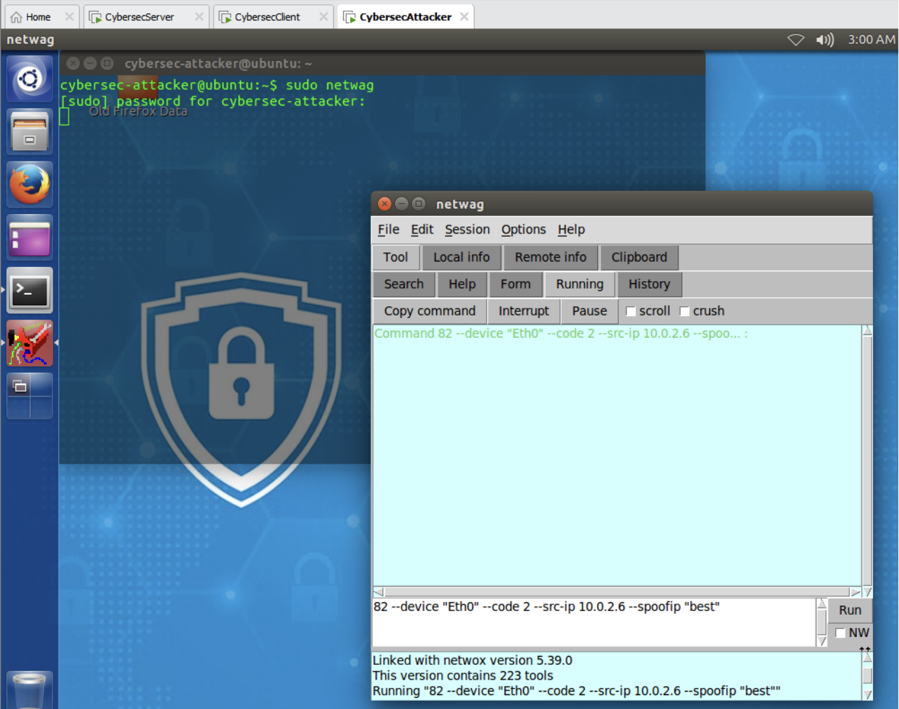

**Observation:** The tool generated a controlled ICMP error message containing information intended to resemble the original network traffic.

### Analyzing the Result in Wireshark

The generated ICMP Destination Unreachable packet was captured and examined in Wireshark.

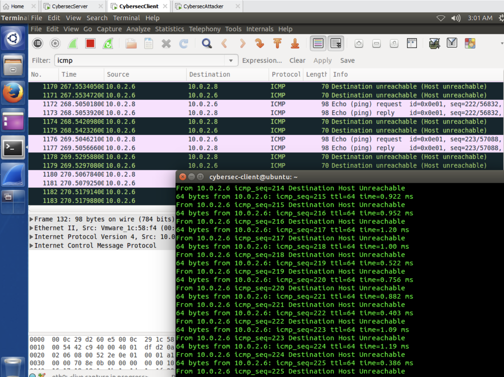

**Result:** Wireshark identified the generated packet as an ICMP Destination Unreachable message, demonstrating how an unauthenticated network-layer error can be introduced into captured traffic.

### Security Analysis

Forged ICMP errors may be used to disrupt communications if a receiving system incorrectly associates them with a legitimate connection.

Potential defensive measures include:

- Validating the embedded packet information inside ICMP error messages.
- Rejecting ICMP messages that do not correspond to legitimate traffic.
- Monitoring unusual volumes of Destination Unreachable messages.
- Using stateful firewalls and intrusion-detection systems.
- Applying network filtering without blocking all necessary ICMP traffic.
- Keeping network devices and operating systems updated.
  
## 4. ICMP Source Quench Analysis

### Technique

ICMP Source Quench was originally designed to tell a transmitting host to reduce its sending rate when network congestion occurred. Because these messages were unauthenticated, they could potentially be forged to interfere with network performance.

ICMP Source Quench is now obsolete and has been formally deprecated. Modern systems should ignore these messages rather than allowing them to control transmission behavior.

### Capturing the Baseline Traffic

Wireshark was used to observe the original network traffic before introducing the Source Quench packet.

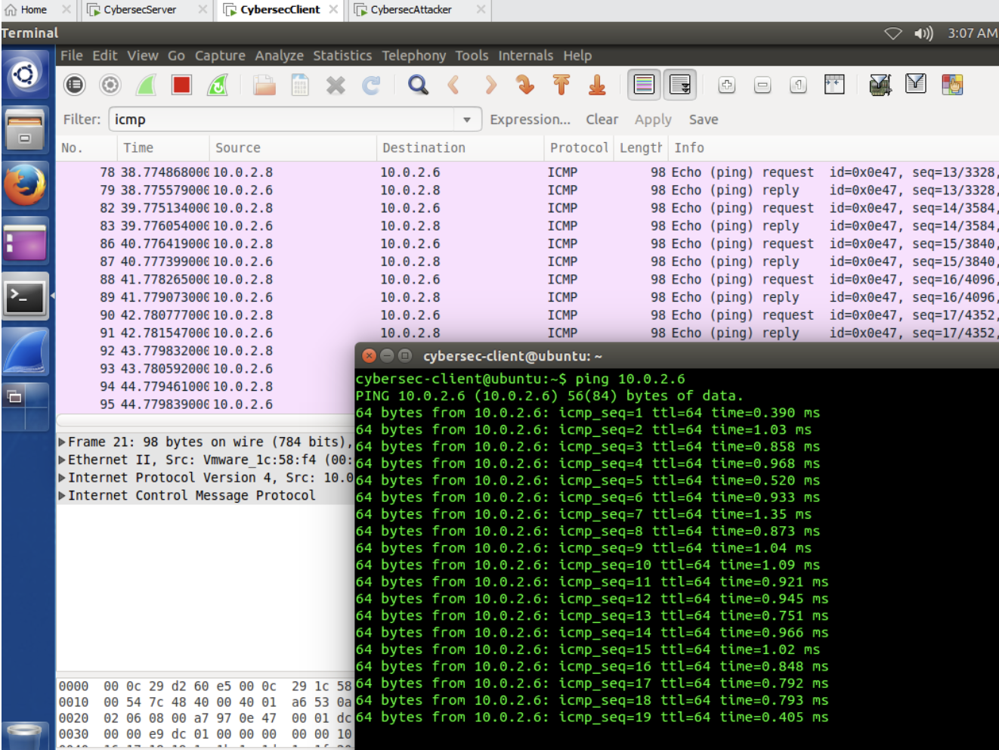

**Observation:** The baseline capture showed the normal traffic pattern before the controlled ICMP message was generated.

### Generating the Source Quench Message

Netwag was configured to generate an ICMP Source Quench message inside the isolated lab environment.

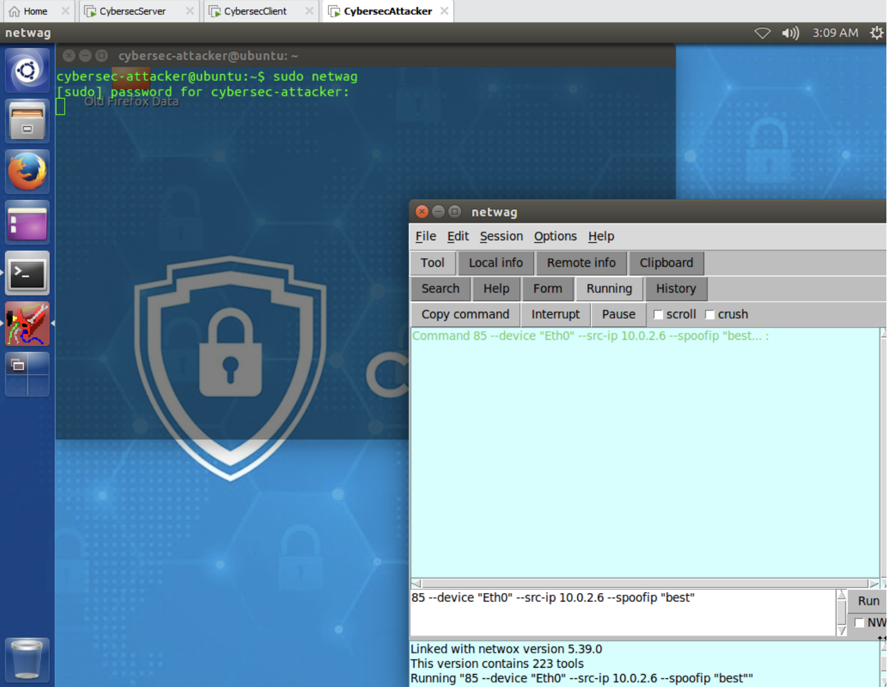

**Observation:** The packet-generation interface was used to reproduce the structure of the deprecated ICMP message for analysis.

### Analysis the Packet in Wireshark

The generated Source Quench packet was captured and inspected in Wireshark.

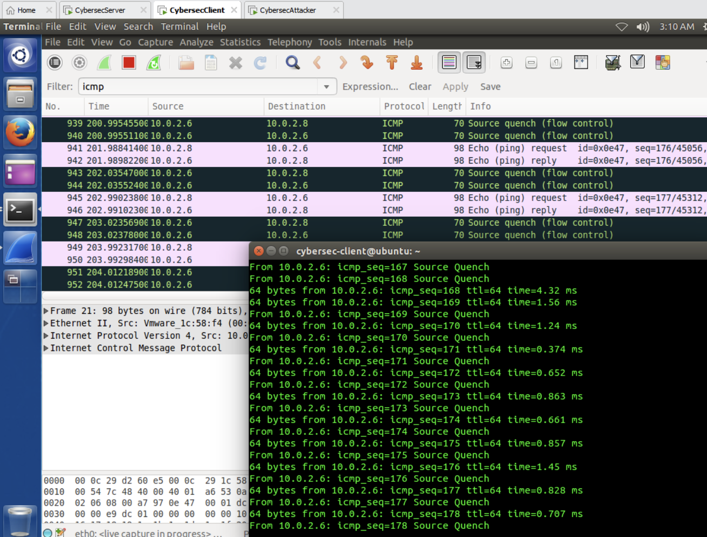

**Result:** Wireshark identified the packet as an ICMP Source Quench message, allowing its type, source address, destination address, and embedded packet information to be examined.

### Security Analysis

An attacker could attempt to forge Source Quench messages to reduce a target's transmission rate or interfere with network performance. Because the message lacks cryptographic authentication, the receiving system cannot reliably confirm that it came from a legitimate network device.

The use of Source Quench has been deprecated because congestion control should be handled by transport protocols rather than unauthenticated ICMP messages.

Potential defensive measures include:

- Configuring systems to ignore ICMP Source Quench messages.
- Keeping operating systems and network devices updated.
- Monitoring networks for obsolete or unexpected ICMP message types.
- Using intrusion-detection systems to identify abnormal ICMP traffic.
- Applying anti-spoofing filters at network boundaries.
- Investigating devices that continue to generate deprecated messages.

